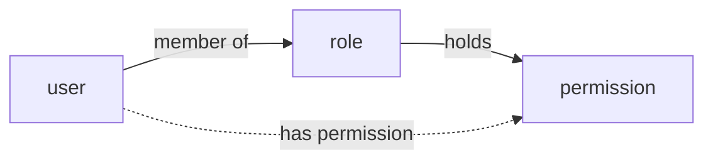
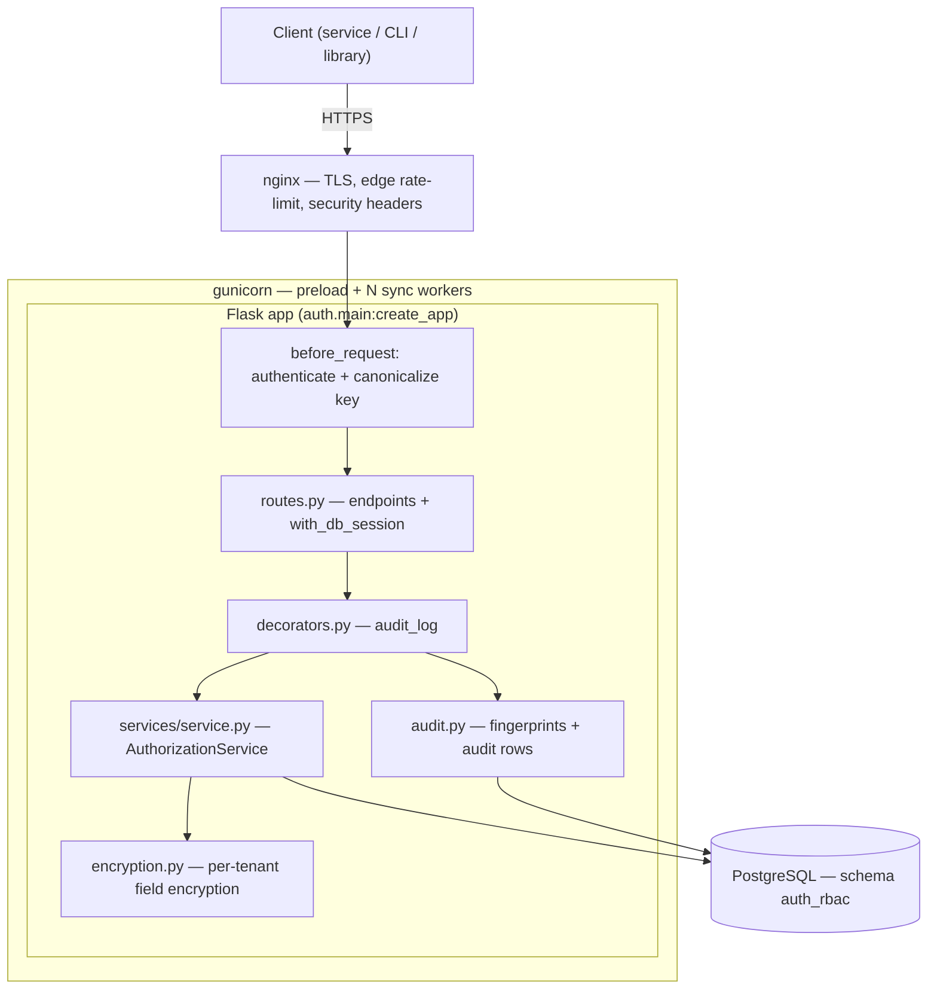
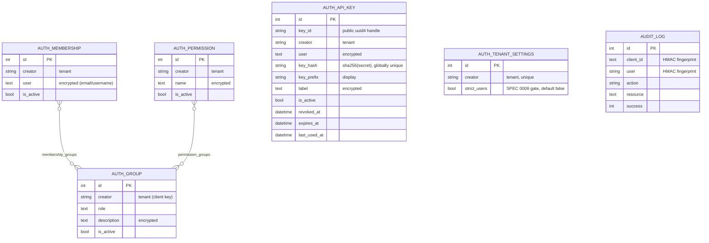
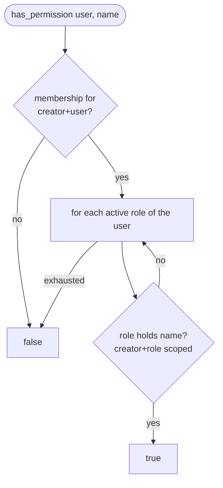
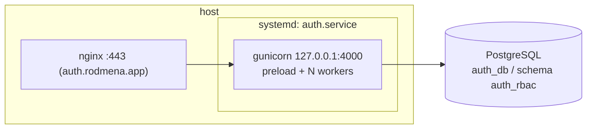

# Architecture

`auth` is an **authorization** service (RBAC over HTTP). It answers one question —
*may user X do Y* — and nothing else: it does not authenticate users, store
passwords, issue JWTs, or manage sessions. Callers bring their own authentication
and ask `auth` what the (already-known) user is allowed to do.

- [Model & tenancy](#model--tenancy)
- [Components](#components)
- [Request lifecycle](#request-lifecycle)
- [Data model](#data-model)
- [Permission check](#permission-check)
- [Key rotation](#key-rotation)
- [Auditing & transactions](#auditing--transactions)
- [Encryption at rest](#encryption-at-rest)
- [Deployment topology](#deployment-topology)

## Model & tenancy

The model is `user → (member of) → role → (holds) → permission`. A user has a
permission iff they belong to some role that holds it.

Every request carries a **client key** — any valid UUID4 — as
`Authorization: Bearer <uuid4>`. The key is **not** checked against a stored
secret; it *is* the tenant identity. Each key opens its own isolated namespace,
so roles/users/permissions under one key are invisible to every other key. There
is no registration step: presenting a fresh UUID4 creates an empty namespace on
first write. The key is canonicalized to lowercase at the edge so case variants
map to one namespace.



## Components



- **nginx** terminates TLS, applies the primary per-IP rate limit, adds security
  headers (HSTS, `X-Frame-Options`, …), and proxies to gunicorn on
  `127.0.0.1:4000`.
- **gunicorn** runs the app `preload`ed across sync workers; each worker disposes
  the inherited engine on fork so no DB socket is shared.
- **Flask app**: a `before_request` gate authenticates every `/api/*` request;
  routes own the request transaction; the service holds all RBAC logic; the
  encryption and audit modules are cross-cutting.
- **PostgreSQL** holds the RBAC tables and the audit log in the configured schema
  (`AUTH_DATABASE_SCHEMA`, e.g. `auth_rbac`). SQLite is supported for local/tests.

## Request lifecycle

Every `/api/*` request is authenticated once up front, then the route and its
audit row commit in a **single transaction**.

```mermaid
sequenceDiagram
  autonumber
  participant C as Client
  participant G as before_request
  participant W as with_db_session
  participant A as audit_log
  participant S as AuthorizationService
  participant DB as PostgreSQL

  C->>G: POST /api/... (Bearer <uuid4>)
  G->>G: validate UUID4, lowercase → g.client_key
  Note over G: missing/!UUID4 → 401/400 (no DB, no audit)
  G->>W: enter route
  W->>DB: open session (no commit yet)
  W->>A: call route (db)
  A->>S: service call (manage_transaction=False)
  S->>DB: advisory lock (per tenant) + upsert/query
  S-->>A: result (no self-commit)
  A->>DB: stage audit row (success = real result)
  A-->>W: response
  W->>DB: COMMIT (mutation + audit together)
  W-->>C: response
  Note over W,DB: any error → ROLLBACK both;<br/>failure audited on a separate session
```

## Data model

Rows are scoped by `creator` (the client key). Junction tables carry no
`creator` — they reference row ids and inherit scope from the rows they link
(links are only ever created within one tenant).



Uniqueness is `(creator, role)`, `(creator, user)`, `(creator, name)`. Writes are
race-free `INSERT … ON CONFLICT` upserts against those constraints.

`auth_api_key` (SPEC 0004) is the per-user API-key registry: the secret is
server-generated (`rak_` + 43 base62), returned once, and stored only as an
unpeppered SHA-256 (256-bit entropy makes offline attack moot, and no pepper
rotation can invalidate issued keys). `key_hash` is globally unique — secrets
are server-minted so cross-tenant collisions cannot occur — giving validate a
single index probe; `key_hash` excludes `creator` so tenant rotation preserves
issued secrets. Inserts are plain INSERTs (no natural upsert key); the 25
active-keys-per-user cap is enforced under the tenant advisory lock.

## Permission check

`GET /api/has_permission/<user>/<name>` — true iff the user belongs to any role
holding the permission. Every query is scoped by `creator`, and the effective
check re-scopes at each hop. When the tenant's `auth_tenant_settings.strict_users`
is true (SPEC 0008/0010), decision endpoints first require the user to hold ≥1
active, unexpired API key — a key-less subject answers negatively with stable
reason `user_not_key_backed` (membership ADDs answer 409); listings and every
delete/revoke path are never gated. Enforcement lives in `AuthorizationService`,
so embedded (in-process) consumers get semantics identical to the REST layer.



## Key rotation

`POST /api/keys/rotate` moves the whole namespace from the old key to a fresh
server-generated key in one transaction (an instant *cutover*). A per-tenant
advisory lock serializes it against concurrent writes; when encryption is on,
each bound cell is re-encrypted under the new key in the same pass.

```mermaid
sequenceDiagram
  autonumber
  participant C as Client (old key)
  participant R as rotate route
  participant S as service
  participant DB as PostgreSQL

  C->>R: POST /api/keys/rotate
  R->>S: rotate_client_key(new = uuid4())
  S->>DB: pg_advisory_xact_lock(tenant)
  loop groups / memberships / permissions / api keys
    S->>DB: read rows (creator = old)
    Note over S: encryption on → decrypt(old) → encrypt(new)
    S->>DB: set creator = new (+ re-keyed cells)
  end
  S-->>R: {new_key, migrated}
  R->>DB: stage ROTATE_KEY audit (old_fpr → new_fpr)
  R->>DB: COMMIT (reassignment + audit atomically)
  R-->>C: {new_key, migrated}
  Note over C: old key now owns nothing;<br/>persist new_key (only copy)
```

## Auditing & transactions

The audit row is written on the **same session** as the mutation and committed by
`with_db_session`, so a mutation can never commit unaudited — if the audit write
fails, the whole request fails closed and the mutation rolls back. `success`
reflects the real operation result (a no-op write like "role missing" is recorded
as a failure), not merely HTTP 200. Failed requests record their attempt on a
separate session (the request transaction is rolling back).

Principals are pseudonymized: the client key and the managed user are stored as
non-reversible HMAC fingerprints (in the DB and, minimally, in the log stream);
role/permission names are not PII and stay readable.

The service exposes `manage_transaction`: the HTTP path sets it `False` so the
route owns the single commit; in-process/library callers leave it `True` and each
method self-commits.

## Encryption at rest

When `AUTH_ENABLE_ENCRYPTION=true`, the encrypted columns (`membership.user`,
`permission.name`, `group.description`, `api_key.user`, `api_key.label`) use
deterministic, authenticated, per-tenant encryption: AES-256-CTR with a synthetic IV `= HMAC(hmac_key,
plaintext)[:16]`, and per-tenant field keys derived from the master key via HKDF
keyed on `creator`. Determinism keeps the columns equality-queryable; the
synthetic IV is re-derived and constant-time checked on read, so a tampered,
corrupt, or wrong-tenant value is rejected (`InvalidCiphertextError`) rather than
silently returned — the field layer fails closed.

## Deployment topology



Deployed as an editable install under a systemd unit (`NoNewPrivileges`,
`PrivateTmp`); code changes go live on `systemctl restart auth`. Schema is created
by `create_all` at boot and changed via migrations — see
[../MIGRATIONS.md](../MIGRATIONS.md). Security model and threat notes:
[SECURITY](../SECURITY.md).
